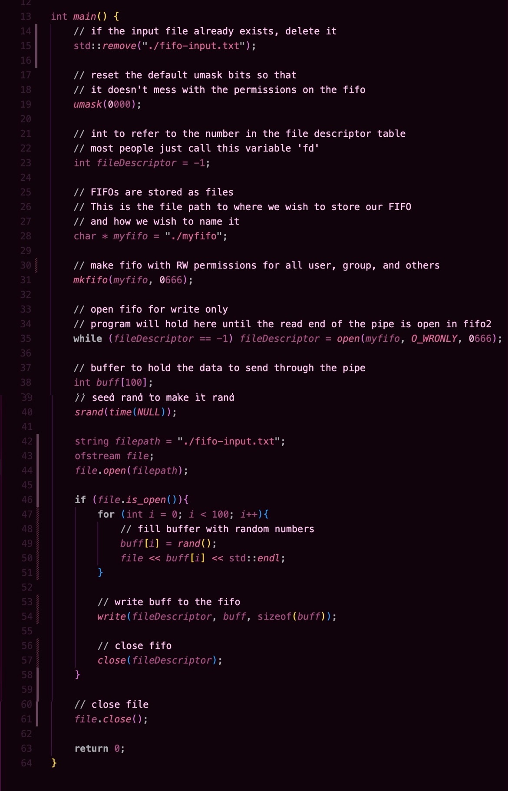
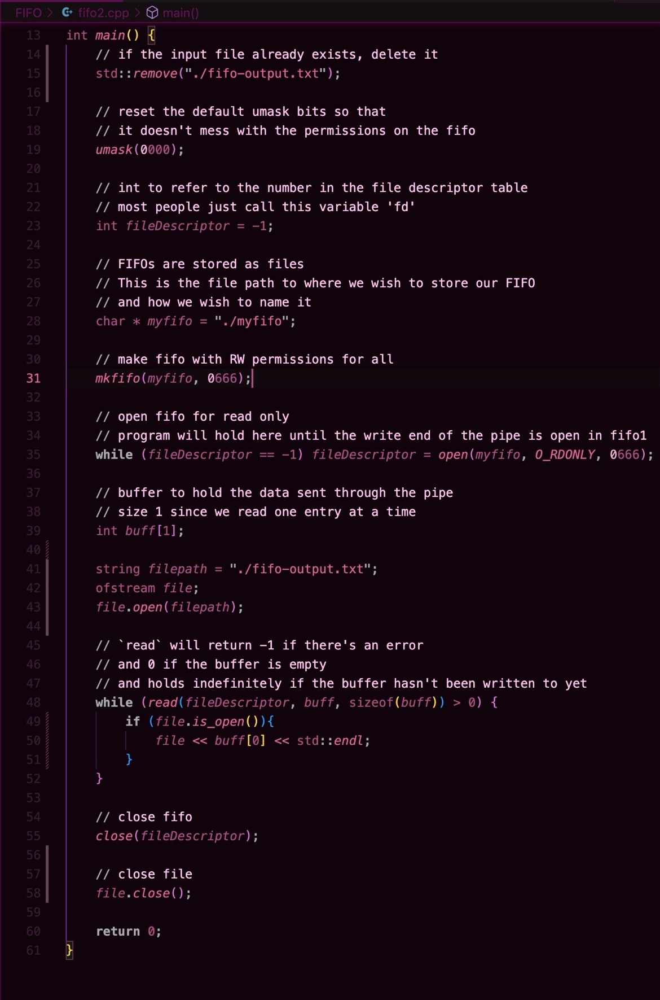
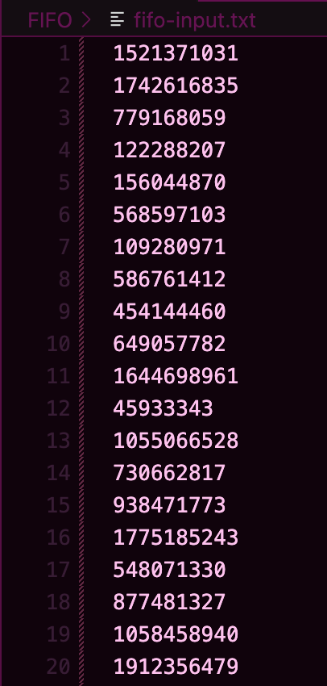
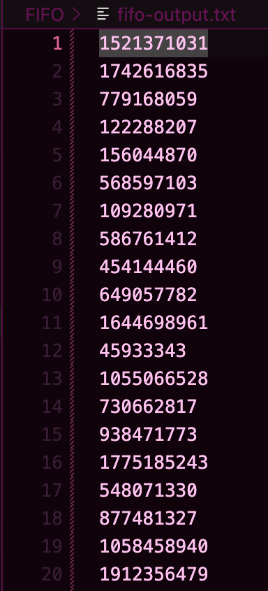

## Inter-Process Communication: Named Pipe / FIFO
System: OSx

Language: C/C++

#### Run Instructions

To run, the user must build an executable from [fifo1.cpp](fifo1.cpp) and [fifo2.cpp](fifo2.cpp) in their local systems and run both at the same time. 

#### Summary
The goal of this IPC method is to write 100 pieces of data to a named pipe, called a "fifo" in OSx, and read the data on the other side of the pipe in a separate process. 

In my implementation, [fifo1.cpp](fifo1.cpp) writes 100 random integers to the fifo `myfifo`, and [fifo2.cpp](fifo2.cpp) reads the integers from `myfifo`. The input from `fifo1.cpp` prints out to [fifo-intput.txt](fifo-input.txt) and the data read from the pipe in `fifo2.cpp` prints out to [fifo-output.txt](./fifo-output.txt). These files are exactly identical, proving that the communication was successful. Specific documentation on the individual steps taken to achieve that goal are written in the comments of the code seen below.

`fifo1.cpp` code and comments:

`fifo2.cpp` code and comments:

The data written to the fifo will differ with each run, but the first 20 lines of data in each file are shown below

`fifo-input.txt`:

`fifo-output.txt`:

#### System Calls Used
- `remove()`: used to remove the input/output files at the beginning of the program if they already exist 
- `mkfifo()`: the method used to create a fifo
- `open(fifo, O_WRONLY | RDONLY, permission_set)`: used to open the fifo for write only or read only
- `file.open(filepath)`: used to open the text file for writing
- `write(fileDescriptor, buff, sizeof(buff))`: used to write to the fifo
- `close(fileDescriptor)`: used to close the pipe 
- `file.close()`: used to close the text file

#### Challenges

One of the biggest challenges with writing the fifo IPC was figuring out how to set the proper file permissions for the fifo. The intention was to set the permissions allow read and write to the user, group, and others, but running `mkfifo(myfifo, 0666)` resulted in permissions that were shifted in some way, like read and *execute* for all instead of write. After some sleuthing, I found out that the default umask bits were modifying my permission set. To solve this, I reset the umask to 0000 at the beginning of both `fifo1.cpp` and `fifo2.cpp`  
