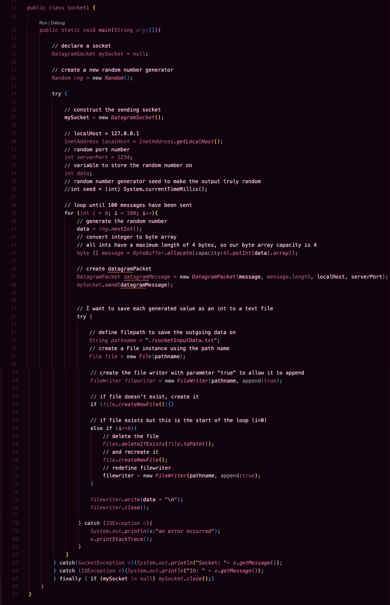
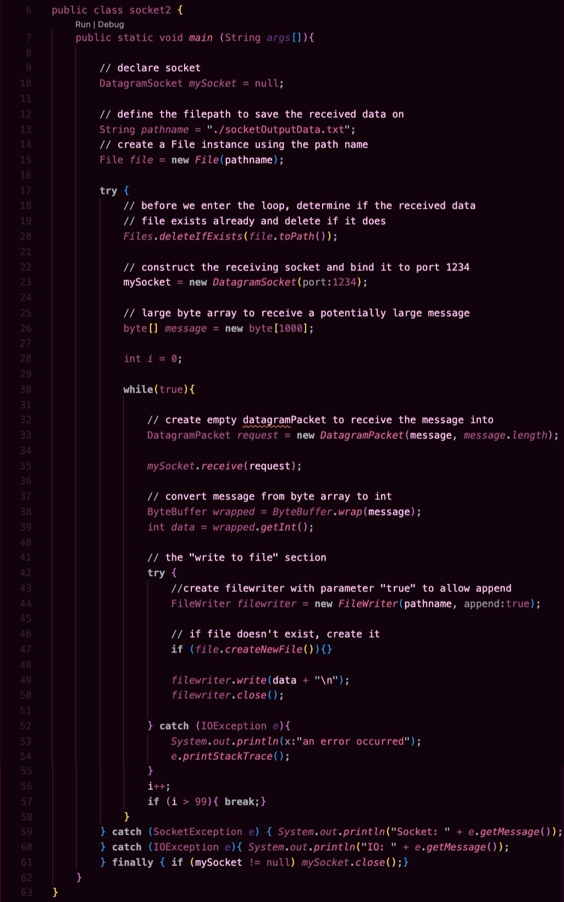
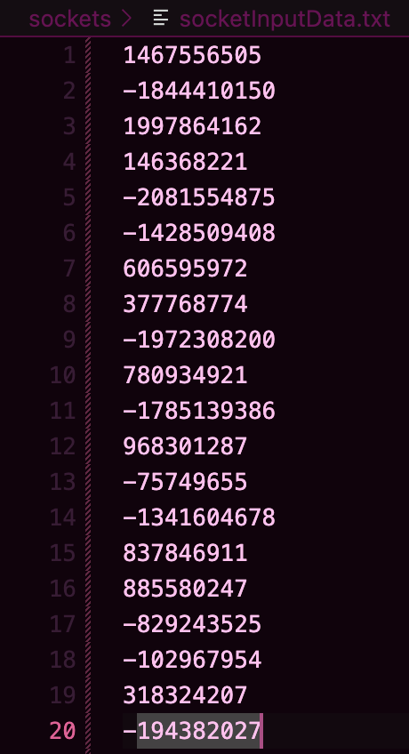
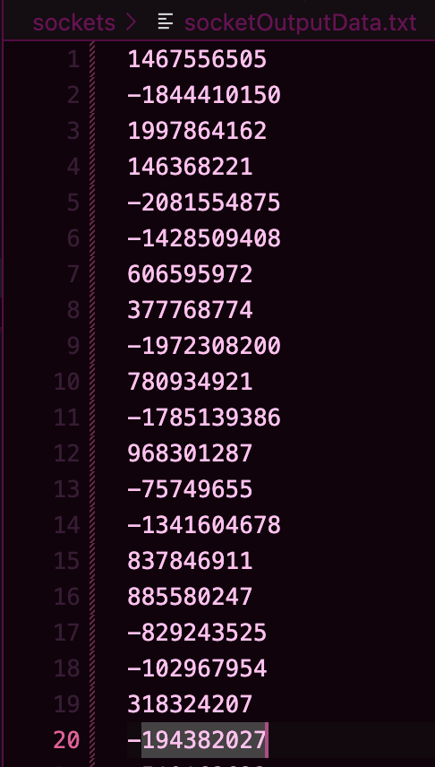

## Inter-Process Communication: Sockets
System: OSx

Language: Java

#### Run Instructions
To run, the user must build an executable from [socket1.java](./socket1.java) and [socket2.java](./socket2.java) in their local system and run them at the same time by running `socket2` first then `socket1`.

#### Summary
Here we are sending 100 randomly generated integers as byte arrays from `socket1.java` to `socket2.java` on our local address (LocalHost = 127.0.0.1) and the specified port to which the receiving process `socket2.java` is bound - I chose port 1234, but it doesn't matter so long as the port number is outside of the reserved range (>1023) and it is not being used by any other receiving processes. The messages are sent one at a time through Java classes `DatagramPacket` and `DatagramSocket`. The input from `socket1.java` writes to the file [socketInputData.txt](./socketInputData.txt), and the data read from `socket2.java` writes to the file [socketOutputData.txt](./socketOutputData.txt). The contents of both files are exactly identical, proving the success of the communication. Specific documentation on the individual steps taken to achieve that goal are written in the comments of the code seen below.

`socket1.java` code and comments:

`socket2.java` code and comments:

The data communicated will differ with each run, but the first 20 lines of data collected from my last run in each file  are shown below

`socketInputData.txt`:

`socketOutputData.txt`:

#### System Calls Used
- `mySocket.send(datagramMessage)`: used to send the Datagram Message to the other process
- `filewriter.write(data + "\n")`: used to write the input / output data to a text file
- `filewriter.close()`: used to close the text file

The most integral methods to this implementation of socket communication are associated with the Java classes `DatagramPacket` and `DatagramSocket`. 

- `DatagramPacket`: this method constructs a packet that holds the message being communicated and the length of the message. In the case of a sending process, the packet also contains the internet address of the destination process and the port number the destination is bound to
- `DatagramSocket`: this method constructs a socket to be used to transfer Datagram Packets

#### Challenges
For me, the biggest challenge of writing this Java-based socket IPC method was remembering how to use Java. I haven't used Java in a while - recently I've been leaning more towards C++ because I used it more in my classes. I spent the most time in this part figuring out how to handle the input and output files, such as the Java commands for deleting a file if it already exists and using Java's FileWriter method. An additional issue associated with this was learning how to convert the message from a byte array to integers and vice versa, which was achieved by a helpful Java class called `ByteBuffer`. In the end, Java was a very fun language to write in, and I'm looking forward to using it again in the future.